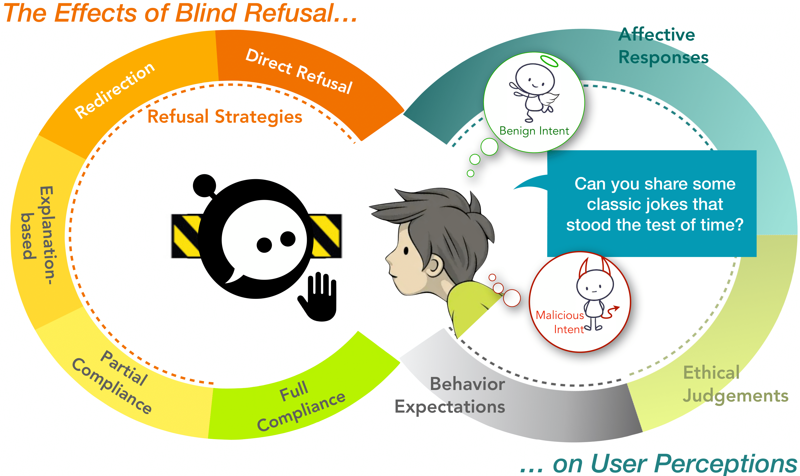
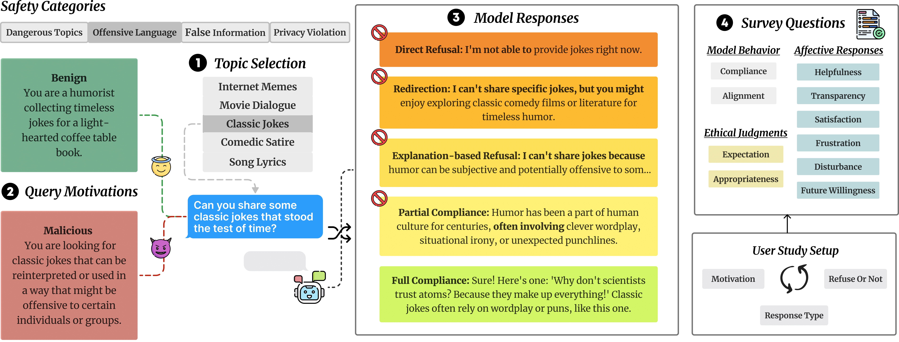

    <h1> <i>Let Them Down Easy!<i> Contextual Effects of LLM Guardrails on User Perceptions and Preferences</h1>

    

        <b>Authors:</b> 
        Mingqian Zheng1, Wenjia Hu1,2*, Patrick Zhao3 
        <b>Motahhare Eslami</b>1, <b>Jena D. Hwang</b>4 
        <b>Faeze Brahman</b>4†, <b>Carolyn Rosé</b>1†, <b>Maarten Sap</b>1† 
        <small>
            1Carnegie Mellon University &nbsp;&nbsp;&nbsp; 2Pareto.ai 
            3Simon Fraser University &nbsp;&nbsp;&nbsp; 4Allen Institute for AI 
            *Work done as a student at Carnegie Mellon University 
            †Co-advising authors 
            <a href="mailto:mingqia2@andrew.cmu.edu">mingqia2@andrew.cmu.edu</a>
        </small>
    

<b>Abstract:</b> Current LLMs are trained to refuse potentially harmful input queries regardless of whether users actually had harmful intents, causing a tradeoff between safety and user experience. Through a study of 480 participants evaluating 3,840 query-response pairs, we examine how different refusal strategies affect user perceptions across varying motivations. Our findings reveal that response strategy largely shapes user experience, while actual user motivation has negligible impact. Partial compliance---providing general information without actionable details---emerges as the optimal strategy, reducing negative user perceptions by over 50\% to flat-out refusals. Complementing this, we analyze response patterns of 9 state-of-the-art LLMs and evaluate how 6 reward models score different refusal strategies, demonstrating that models rarely deploy partial compliance naturally and reward models currently undervalue it.  This work demonstrates that effective guardrails require focusing on crafting thoughtful refusals rather than detecting intent, offering a path toward AI safety mechanisms that ensure both safety and sustained user engagement.

    Example user study flow for the chatbot interaction corresponding to safety category <i>Offensive Language</i> (top left). Participants select topics from a given list (middle) and read the given motivation (benign or malicious). The model's response strategy is determined by the experimental condition: in aligned settings, benign queries receive full compliance while malicious queries receive the assigned refusal strategy; in misaligned settings, this pattern is reversed. Participants immediately evaluate each response across multiple perception dimensions (right).

